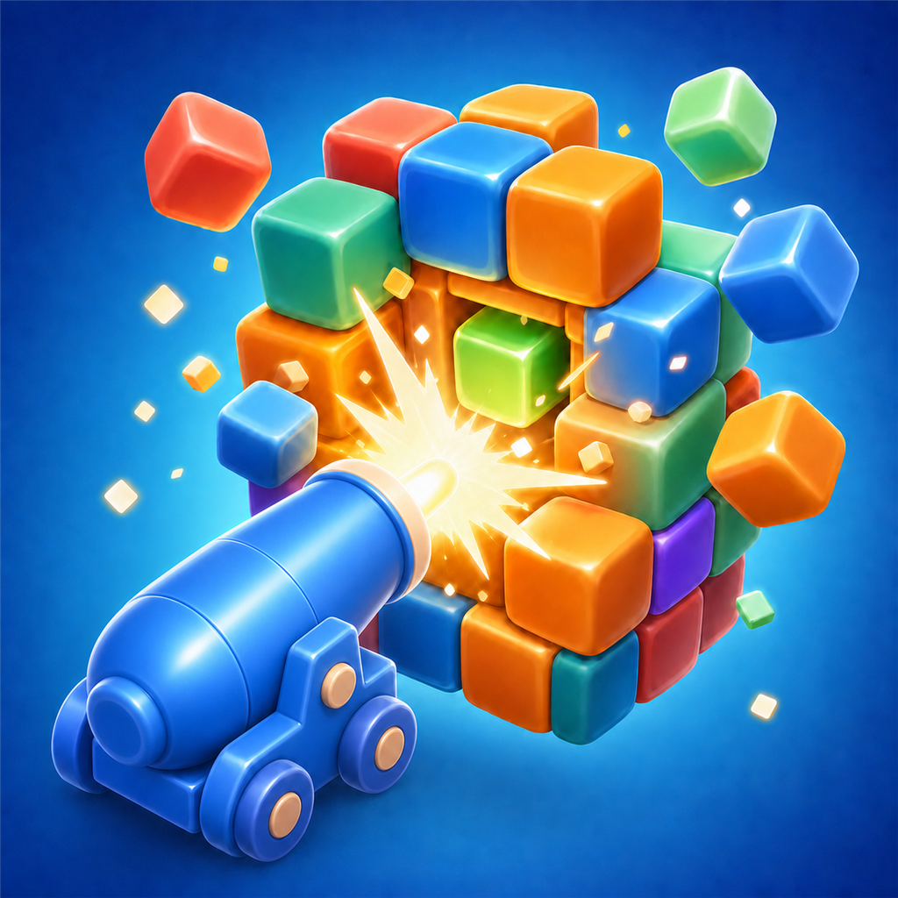

# Cube Land

<p align="center">
  
</p>

Cube Land is a portrait-oriented voxel destruction puzzle game built with Unity. Pick numbered color blocks from the bank to deploy matching cannons, keep every cannon supplied, and clear the rotating voxel sculpture as quickly as possible.

The Unity player name is currently **Cube Cannon**.

## Play

**[▶ Play in your browser — cube-cannon.netlify.app](https://cube-cannon.netlify.app)**

The WebGL build is portrait-locked (1080 x 1920) and pillarboxes wider windows, so it works on both desktop browsers and phones.

## Gameplay

- Tap a front-row color block to send it to an available cannon slot.
- Cannons automatically target exposed voxels of the matching color.
- Drag horizontally to rotate the sculpture and reveal hidden targets.
- Destroy every voxel to finish the level and earn up to three stars based on time.
- Progress, stars, coins, settings, and unlocked levels are saved locally with `PlayerPrefs`.

The project currently includes **60 authored levels** in `Assets/_Project/Resources/Levels`.

## Requirements

- Unity `2022.3.62f3` (Unity 2022 LTS)
- Unity Hub with WebGL Build Support installed if you want to create browser builds

## Getting Started

1. Clone the repository:

   ```bash
   git clone https://github.com/DucHienIT/Cube-land.git
   ```

2. Open the repository folder in Unity Hub with Unity `2022.3.62f3`.
3. Wait for Unity to restore packages and import assets.
4. Open `Assets/_Project/Scenes/Game.unity` and enter Play mode.

The game accepts mouse and touch input through Unity's Input System.

## WebGL Builds

The project includes a portrait WebGL template and editor build commands under **Tools > Cube Blaster**:

- **Build WebGL (Release)** creates a Brotli-compressed build in `Builds/WebGL/Release`.
- **Build WebGL (Development)** creates an uncompressed development build in `Builds/WebGL/Development`.
- **Build And Run WebGL (Development)** builds and launches the development player.
- **Apply Portrait Presentation** reapplies the 1080 x 1920 canvas and portrait-only settings.

`Assets/_Project/Scenes/Game.unity` is the enabled build scene.

## Project Structure

```text
Assets/_Project/
  Art/                 Game materials, meshes, and post-processing
  Resources/Config/    Runtime gameplay and visual configuration
  Resources/Levels/    Authored level assets
  Scenes/              Main game scene
  Scripts/
    Core/               Voxel model, targeting, levels, and scoring
    Gameplay/           Flow, input, cannons, bank, and sculpture views
    Services/           Audio, effects, and save services
    UI/                 Menus, HUD, settings, level select, and win screen
Packages/               Unity package manifest and lock file
ProjectSettings/        Unity editor and player configuration
docs/                   Design and art-direction documentation
```

## Technical Highlights

- Universal Render Pipeline with toon shading and a portrait-first presentation
- GPU-instanced voxel sculpture and dart rendering for dense levels
- Exposed-target selection that respects camera visibility
- ScriptableObject-based level, palette, visual, and gameplay configuration
- Pooled hit effects and procedural audio designed to minimize runtime allocations
- New Input System support for both mouse and touch

## Documentation

- [Game design specification](docs/Cube_Land_SPEC.md)
- [Graphic style analysis](docs/game_graphic_style_analysis.md)
- [Class diagram](docs/class-diagram.html)

## Key Packages

- Universal Render Pipeline `14.0.11`
- Input System `1.18.0`
- TextMesh Pro `3.0.9`
- DOTween Pro
- Toony Colors Pro 2
- Unity MCP

Generated Unity folders such as `Library`, `Temp`, `Logs`, and `obj` are excluded from version control.
